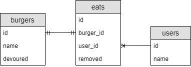
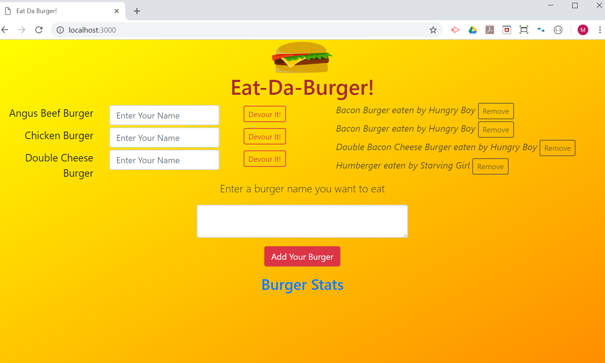
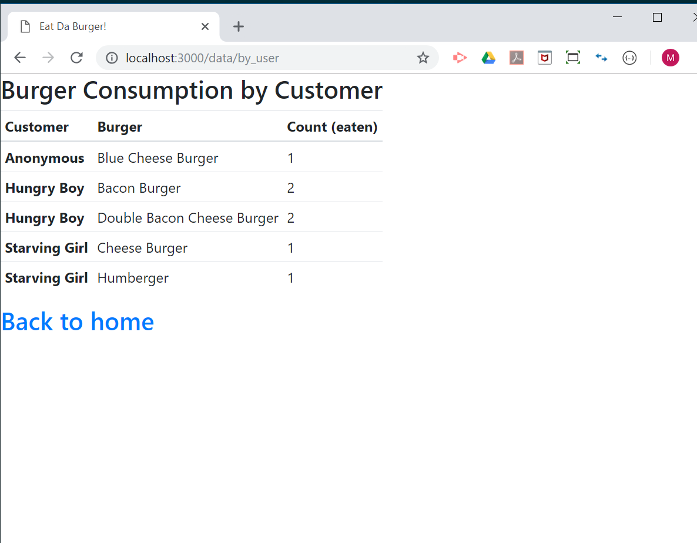

# Eat-Da-Burger! Part 2 -- Node Express Handlebars on Sequel

## Overview

* Eat-Da-Burger! is a restaurant app that lets users input the names of burgers they'd like to eat. Whenever a user submits a burger's name, the app will display the burger on the left side of the page -- waiting to be devoured.

* Each burger in the waiting area also has a `Devour it!` button along with an open text box. When the user enters his/her name and clicks on `Devour it!` button, the burger will move to the right side of the page.

* Each `devoured` burger on the right side also has a `Remove` button to be deleted from the list.

### Deployment and Availability

* Heroku
  * Live app - https://damp-forest-95991.herokuapp.com/
* GitHub
  * Repository - https://github.com/mmakino/sequelizedBurger

### Intallation

* This full stack app can also be installed __locally__ through the following steps 

1. Clone the git repository
    ```
    git clone https://github.com/mmakino/sequelizedBurger.git
    ```
1. Install necessary packages
    ```
    npm install
    ```
    * This app uses the following NPM packages:
    ```
    "dotenv": "^6.2.0",
    "express": "^4.16.4",
    "express-handlebars": "^3.0.0",
    "mysql2": "^1.6.4",
    "sequelize": "^4.42.0"
    ```
1. Create a `.env` file under the top burger app directory for MySQL connection. Enter the user and password in the file. The format is simple as below:
    ```
    # MySQL user and password for a local server
    MYSQL_USER=<user_name>
    MYSQL_PASSWD=<password>
    ```
1. MySQL database setup
    * MySQL database needs to be up and running with all CRUD privileges.
    * `db` subdirectory contains two SQL query files.
    ```
      db
      ├── schema.sql
      └── seed.sql
    ```
    * The `schema.sql` exists just for a reference
        * Database: burgers_db
        * Table: burgers
    * The `seed.sql` may be used to populate with small mock data(burgers!).
1. Start the web server
    ```
    node server.js
    ```
    * It should display the following message when the server has started successfully
      ```
      Server started listening on port 3000
      Connected to database as ID: 771
      ```
1. Open the web page in a browser by entering the following URL into the address bar.
    ```
    http://localhost:3000/
    ```

### Demo
* Although this is one page small app, hope the following snapshots give some ideas

* Database table schema:
    
* Enter a name and clicking on `Devour It!` button will move the burger to the right side.
    
* `Burger Stas`: Customer(user) and Burger Data Summary
    
    
### Directories & Files
```
sequelizedBurger
├── config/
│   └── config.json*                -- Sequelize framework config JSON
├── controllers/
│   └── burgers_controller.js*      -- Controller with routes (m[V]c)
├── db/
│   ├── schema.sql*                 -- database schema
│   └── seed.sql*                   -- mock seed data set
├── homework/                       -- Foler for the homework instruction
│   ├── Images/
│   │   ├── 1-Sequelized.jpg*
│   │   ├── 2-Migrated.jpg*
│   │   └── 3-Associated.jpg*
│   └── homework_instructions.md*  
├── migrations/
├── models/                         -- Models for Sequelize schema
│   ├── burger.js*                  -- a model for burgers
│   ├── eatDaBurger.js*             -- a model for burgers & users
│   ├── index.js*                   -- setup javascript for all models
│   └── user.js*                    -- a model for users
├── public/
│   └── assets/
│       ├── css/
│       │   └── style.css*          -- Style sheet for the frontend
│       ├── image/
│       │   ├── burger.png*         -- Burger clipart image
│       │   ├── demo-5.png*         -- For this README
│       │   ├── demo-6.png*         -- For this README
│       │   └── demo-7.png*         -- For this README
│       └── javascript/
│           └── app.js*             -- jQuery AJAX for accessing routes
├── seeders/
├── views/                          -- Handlebars view folder
│   ├── images/
│   ├── layouts/
│   │   └── main.handlebars*        -- Main page handlebars file
│   ├── index.handlebars*           -- Main page body handlebars file
│   └── users.handlebars*           -- User/Consumer & burgers stats page
├── README.md*                      -- This file
├── package.json*                   -- npm json package file
└── server.js*                      -- The main server javascript file

16 directories, 24 files
```

#### Written by [Motohiko Makino](https://mmakino.github.io/)

